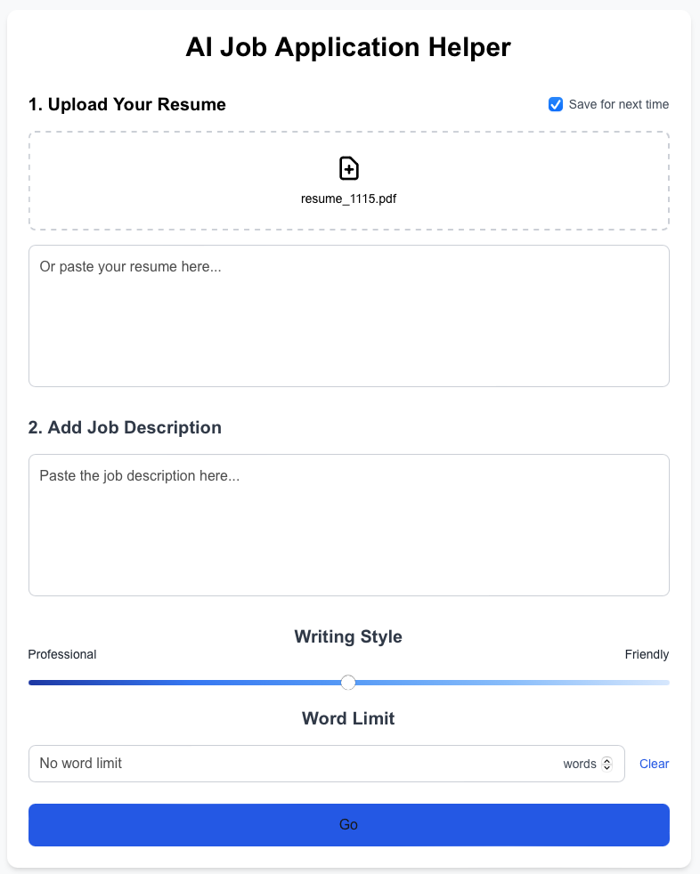

## Introduction

We create a web app to help you auto-generate a cover letter by LLM (google Gemini)

visit: https://ai-job-application-helper.vercel.app/


#### What you need to prepare:

1. your resume (a PDF file or text)
2. job description (copy and paste)

#### Work flow:

1. upload yout resume
2. paste the job description in the text box
3. drag the sliding bar to choose the output writing style
4. choose output word limit (optional)
5. click Go button and you will get some recommendations for your resume and get a cover letter




## Run on your local machine

First, install the relative modules:

```bash
npm install
```

then, run the development server:

```bash
npm run dev
# or
yarn dev
# or
pnpm dev
# or
bun dev
```

Open [http://localhost:3000](http://localhost:3000) with your browser to see the result.

## Visit our website, it is deployed by Vercel

visit: https://ai-job-application-helper.vercel.app/

We use Vercel as our deployment platform.

## Team members
Sarkan, Harris, Chun-Wen, Tamir. 

Created at 11/16/2024, Open Source AI Hackathon by Mocrosoft at Microsoft Reactor Redmond, WA
